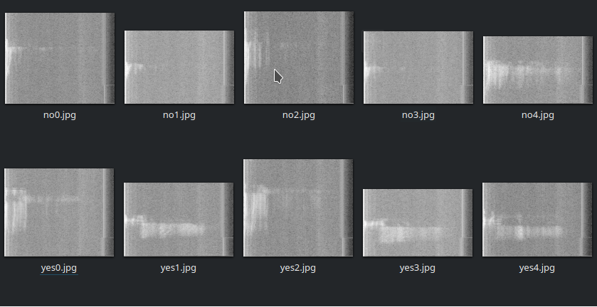

  

# Voice classification to recognize Yes-No instructions

This dataset1 contains sounds and spectrograms images of yes/no words

The data can be used to build and train an ML model that can classify a yes/no sound converted to spectrogram with high accuracy

# Structure

This repo contains the following structure:

- **train**: original sounds converted to mono
- **train_images**: spectrograms images from each shound converted used the notebook sound_2_spectrograms.ipynb
- **dataset.csv**: CSV file with all required data.

  

The following shows a partial example of the data stored in **dataset.csv** that is used as the main example.

| **labels**  | **images**                    |
|-------------|-------------------------------|
| yes       | train_images/yes0.jpg       |
| yes       | train_images/yes1.jpg       |
| no        | train_images/no0.jpg |
| no        | train_images/no1.jpg |

The labels on CSV are:

- **yes**: yes word
- **no**: no word

# Community

Got questions, feedback, or want to join a community of machine learning practitioners working with exciting tools and projects? Check out our [Community](https://forum.perceptilabs.com/)!

1 Dataset Credits: https://github.com/vi/codegolf-jein

